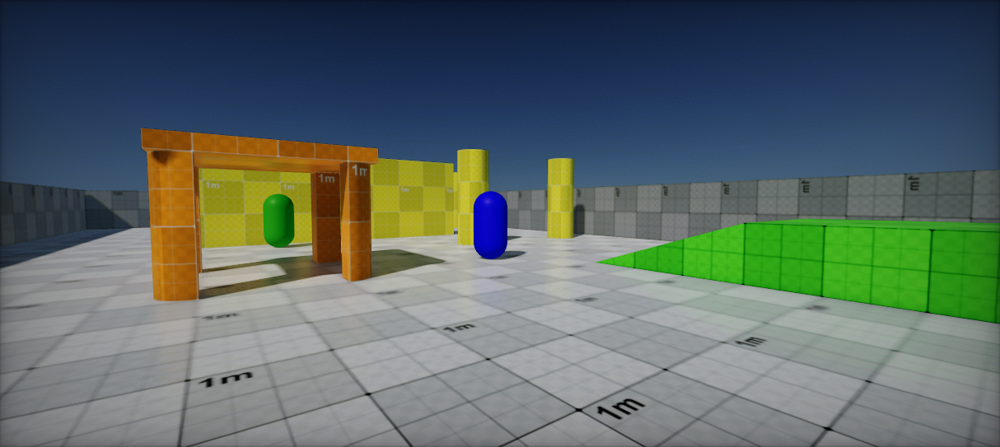
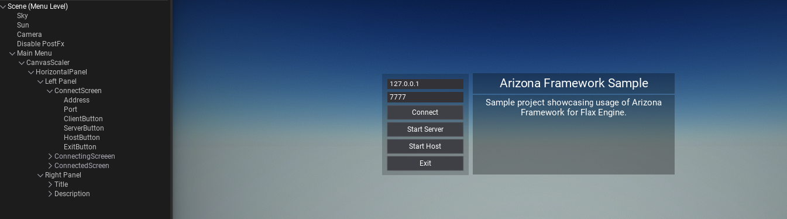
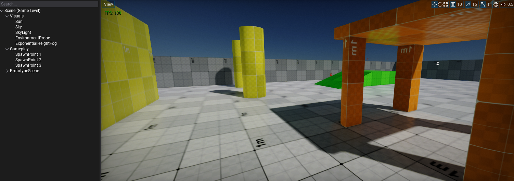

# Arizona Framework Sample

Sample project showcasing usage of [Arizona Framework](https://github.com/FlaxEngine/ArizonaFramework) for [Flax Engine](https://flaxengine.com/).

## License

Both this sample and Arizona Framework are released under **MIT License**.

## Documentation

### Main Menu

**Menu Level** contains the game's main menu which is the first scene to be loaded on the game start. It allows specifying the server IP address and port to use for connecting or game hosting. UI handles focus navigation thus it is usable via gamepad only.

### Game Level

**Game Level** is a sample scene with basic lighting (sun, sky light, env probe) with enabled [volumetric fog](https://docs.flaxengine.com/manual/graphics/fog-effects/volumetric-fog.html) and [global illumination](https://docs.flaxengine.com/manual/graphics/lighting/gi/realtime.html). It uses prototype assets from Arizona Framework for level blockout.

Game Levels can be easily playtested with local game hosting (implemented in `MyGameEditor`) - simply hit *Play* button.
